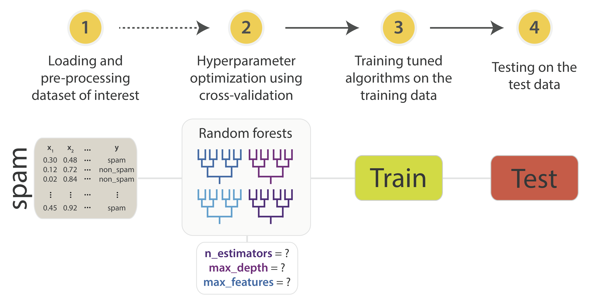
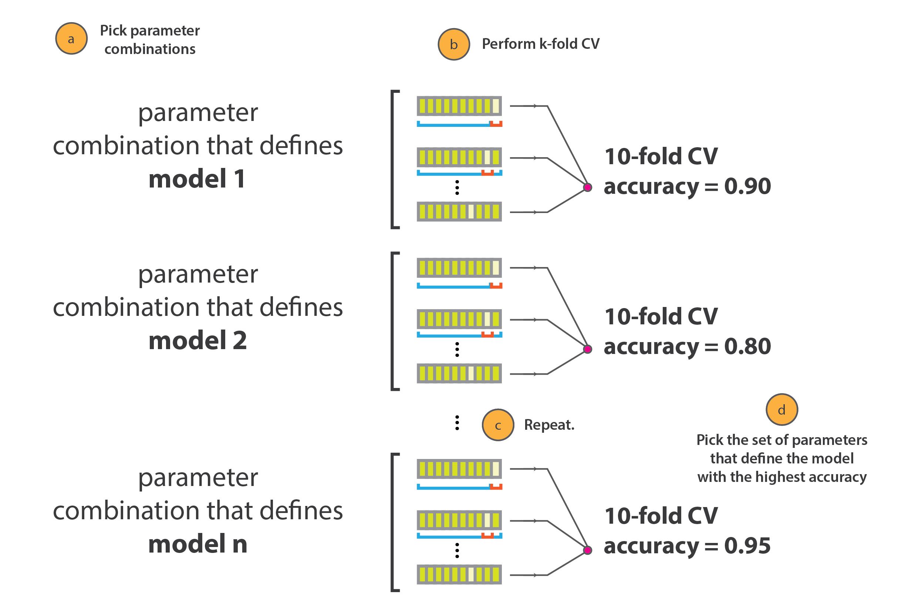

# Polished prediction: how to tune machine learning models

## Introduction

When doing machine learning using Python's scikit-learn library, we can often get reasonable model performance by using out-of-the-box settings. However, the payoff can be huge if you invest at least some time into tuning models to your specific problem and dataset. [In the previous post](http://blog.cambridgecoding.com/2016/03/24/misleading-modelling-overfitting-cross-validation-and-the-bias-variance-trade-off/), we explored the concepts of overfitting, cross-validation, and the bias-variance tradeoff. These ideas turn out to be central to doing a good job at optimizing the **hyperparameters** (roughly, the settings) of algorithms. In this  post, we will explore the concepts behind hyperparameter optimization and demonstrate the process of tuning and training a random forest classifier.

You'll be working with the famous (well, machine learning famous!) [spam dataset](https://archive.ics.uci.edu/ml/datasets/Spambase), which contains loads of [NLP](https://en.wikipedia.org/wiki/Natural_language_processing)-mined features of spam and non-spam emails, like the frequencies of the words "money", "free" and "viagra". Our goal is to tune and apply a random forest to these features in order to predict whether a given email is spam. 

The steps we'll cover in this blog post can be summarized as follows:



In the next two posts, you will learn about different strategies for model optimization and how to tune a support vector machine and logistic regression classifier. You will also find out how to take several different tuned models and combine them to build an ensemble model, which is a type of aggregated meta-model that often has higher accuracy and lower overfitting than its constituents.

Let's get cracking.

## Loading and exploring the dataset

We start off by collecting the dataset. It can be found both [online](https://archive.ics.uci.edu/ml/datasets/Spambase) and (in a slightly nicer form) in our GitHub repository, so we can just fetch it via `wget` (note: make sure you first type `pip install wget` into your terminal since `wget` is not a preinstalled Python library). It will download a copy of the dataset to your current working directory.


```python
import wget
import pandas as pd

# Import the dataset
data_url = 'https://raw.githubusercontent.com/nslatysheva/data_science_blogging/master/datasets/spam/spam_dataset.csv'
dataset = wget.download(data_url)
dataset = pd.read_csv(dataset, sep=",")

# Take a peak at the data
dataset.head()
```


<div>
<table border="1" class="dataframe">
  <thead>
    <tr style="text-align: right;">
      <th></th>
      <th>word_freq_make</th>
      <th>word_freq_address</th>
      <th>word_freq_all</th>
      <th>word_freq_3d</th>
      <th>word_freq_our</th>
      <th>word_freq_over</th>
      <th>word_freq_remove</th>
      <th>word_freq_internet</th>
      <th>word_freq_order</th>
      <th>word_freq_mail</th>
      <th>...</th>
      <th>char_freq_;</th>
      <th>char_freq_(</th>
      <th>char_freq_[</th>
      <th>char_freq_!</th>
      <th>char_freq_$</th>
      <th>char_freq_#</th>
      <th>capital_run_length_average</th>
      <th>capital_run_length_longest</th>
      <th>capital_run_length_total</th>
      <th>is_spam</th>
    </tr>
  </thead>
  <tbody>
    <tr>
      <th>0</th>
      <td>0.00</td>
      <td>0.64</td>
      <td>0.64</td>
      <td>0</td>
      <td>0.32</td>
      <td>0.00</td>
      <td>0.00</td>
      <td>0.00</td>
      <td>0.00</td>
      <td>0.00</td>
      <td>...</td>
      <td>0.00</td>
      <td>0.000</td>
      <td>0</td>
      <td>0.778</td>
      <td>0.000</td>
      <td>0.000</td>
      <td>3.756</td>
      <td>61</td>
      <td>278</td>
      <td>1</td>
    </tr>
    <tr>
      <th>1</th>
      <td>0.21</td>
      <td>0.28</td>
      <td>0.50</td>
      <td>0</td>
      <td>0.14</td>
      <td>0.28</td>
      <td>0.21</td>
      <td>0.07</td>
      <td>0.00</td>
      <td>0.94</td>
      <td>...</td>
      <td>0.00</td>
      <td>0.132</td>
      <td>0</td>
      <td>0.372</td>
      <td>0.180</td>
      <td>0.048</td>
      <td>5.114</td>
      <td>101</td>
      <td>1028</td>
      <td>1</td>
    </tr>
    <tr>
      <th>2</th>
      <td>0.06</td>
      <td>0.00</td>
      <td>0.71</td>
      <td>0</td>
      <td>1.23</td>
      <td>0.19</td>
      <td>0.19</td>
      <td>0.12</td>
      <td>0.64</td>
      <td>0.25</td>
      <td>...</td>
      <td>0.01</td>
      <td>0.143</td>
      <td>0</td>
      <td>0.276</td>
      <td>0.184</td>
      <td>0.010</td>
      <td>9.821</td>
      <td>485</td>
      <td>2259</td>
      <td>1</td>
    </tr>
    <tr>
      <th>3</th>
      <td>0.00</td>
      <td>0.00</td>
      <td>0.00</td>
      <td>0</td>
      <td>0.63</td>
      <td>0.00</td>
      <td>0.31</td>
      <td>0.63</td>
      <td>0.31</td>
      <td>0.63</td>
      <td>...</td>
      <td>0.00</td>
      <td>0.137</td>
      <td>0</td>
      <td>0.137</td>
      <td>0.000</td>
      <td>0.000</td>
      <td>3.537</td>
      <td>40</td>
      <td>191</td>
      <td>1</td>
    </tr>
    <tr>
      <th>4</th>
      <td>0.00</td>
      <td>0.00</td>
      <td>0.00</td>
      <td>0</td>
      <td>0.63</td>
      <td>0.00</td>
      <td>0.31</td>
      <td>0.63</td>
      <td>0.31</td>
      <td>0.63</td>
      <td>...</td>
      <td>0.00</td>
      <td>0.135</td>
      <td>0</td>
      <td>0.135</td>
      <td>0.000</td>
      <td>0.000</td>
      <td>3.537</td>
      <td>40</td>
      <td>191</td>
      <td>1</td>
    </tr>
  </tbody>
</table>
<p>5 rows × 58 columns</p>
</div>


You can examine the dimensions of the dataset and the column names:


```python
# Examine shape of dataset and the column names
print (dataset.shape)
print (dataset.columns.values)
```

    (4601, 58)
    ['word_freq_make' 'word_freq_address' 'word_freq_all' 'word_freq_3d'
     'word_freq_our' 'word_freq_over' 'word_freq_remove' 'word_freq_internet'
     'word_freq_order' 'word_freq_mail' 'word_freq_receive' 'word_freq_will'
     'word_freq_people' 'word_freq_report' 'word_freq_addresses'
     'word_freq_free' 'word_freq_business' 'word_freq_email' 'word_freq_you'
     'word_freq_credit' 'word_freq_your' 'word_freq_font' 'word_freq_000'
     'word_freq_money' 'word_freq_hp' 'word_freq_hpl' 'word_freq_george'
     'word_freq_650' 'word_freq_lab' 'word_freq_labs' 'word_freq_telnet'
     'word_freq_857' 'word_freq_data' 'word_freq_415' 'word_freq_85'
     'word_freq_technology' 'word_freq_1999' 'word_freq_parts' 'word_freq_pm'
     'word_freq_direct' 'word_freq_cs' 'word_freq_meeting' 'word_freq_original'
     'word_freq_project' 'word_freq_re' 'word_freq_edu' 'word_freq_table'
     'word_freq_conference' 'char_freq_;' 'char_freq_(' 'char_freq_['
     'char_freq_!' 'char_freq_$' 'char_freq_#' 'capital_run_length_average'
     'capital_run_length_longest' 'capital_run_length_total' 'is_spam']


Get some summary statistics on the features using `describe()`:


```python
# Summarise feature values
dataset.describe()
```


<div>
<table border="1" class="dataframe">
  <thead>
    <tr style="text-align: right;">
      <th></th>
      <th>word_freq_make</th>
      <th>word_freq_address</th>
      <th>word_freq_all</th>
      <th>word_freq_3d</th>
      <th>word_freq_our</th>
      <th>word_freq_over</th>
      <th>word_freq_remove</th>
      <th>word_freq_internet</th>
      <th>word_freq_order</th>
      <th>word_freq_mail</th>
      <th>...</th>
      <th>char_freq_;</th>
      <th>char_freq_(</th>
      <th>char_freq_[</th>
      <th>char_freq_!</th>
      <th>char_freq_$</th>
      <th>char_freq_#</th>
      <th>capital_run_length_average</th>
      <th>capital_run_length_longest</th>
      <th>capital_run_length_total</th>
      <th>is_spam</th>
    </tr>
  </thead>
  <tbody>
    <tr>
      <th>count</th>
      <td>4601.000000</td>
      <td>4601.000000</td>
      <td>4601.000000</td>
      <td>4601.000000</td>
      <td>4601.000000</td>
      <td>4601.000000</td>
      <td>4601.000000</td>
      <td>4601.000000</td>
      <td>4601.000000</td>
      <td>4601.000000</td>
      <td>...</td>
      <td>4601.000000</td>
      <td>4601.000000</td>
      <td>4601.000000</td>
      <td>4601.000000</td>
      <td>4601.000000</td>
      <td>4601.000000</td>
      <td>4601.000000</td>
      <td>4601.000000</td>
      <td>4601.000000</td>
      <td>4601.000000</td>
    </tr>
    <tr>
      <th>mean</th>
      <td>0.104553</td>
      <td>0.213015</td>
      <td>0.280656</td>
      <td>0.065425</td>
      <td>0.312223</td>
      <td>0.095901</td>
      <td>0.114208</td>
      <td>0.105295</td>
      <td>0.090067</td>
      <td>0.239413</td>
      <td>...</td>
      <td>0.038575</td>
      <td>0.139030</td>
      <td>0.016976</td>
      <td>0.269071</td>
      <td>0.075811</td>
      <td>0.044238</td>
      <td>5.191515</td>
      <td>52.172789</td>
      <td>283.289285</td>
      <td>0.394045</td>
    </tr>
    <tr>
      <th>std</th>
      <td>0.305358</td>
      <td>1.290575</td>
      <td>0.504143</td>
      <td>1.395151</td>
      <td>0.672513</td>
      <td>0.273824</td>
      <td>0.391441</td>
      <td>0.401071</td>
      <td>0.278616</td>
      <td>0.644755</td>
      <td>...</td>
      <td>0.243471</td>
      <td>0.270355</td>
      <td>0.109394</td>
      <td>0.815672</td>
      <td>0.245882</td>
      <td>0.429342</td>
      <td>31.729449</td>
      <td>194.891310</td>
      <td>606.347851</td>
      <td>0.488698</td>
    </tr>
    <tr>
      <th>min</th>
      <td>0.000000</td>
      <td>0.000000</td>
      <td>0.000000</td>
      <td>0.000000</td>
      <td>0.000000</td>
      <td>0.000000</td>
      <td>0.000000</td>
      <td>0.000000</td>
      <td>0.000000</td>
      <td>0.000000</td>
      <td>...</td>
      <td>0.000000</td>
      <td>0.000000</td>
      <td>0.000000</td>
      <td>0.000000</td>
      <td>0.000000</td>
      <td>0.000000</td>
      <td>1.000000</td>
      <td>1.000000</td>
      <td>1.000000</td>
      <td>0.000000</td>
    </tr>
    <tr>
      <th>25%</th>
      <td>0.000000</td>
      <td>0.000000</td>
      <td>0.000000</td>
      <td>0.000000</td>
      <td>0.000000</td>
      <td>0.000000</td>
      <td>0.000000</td>
      <td>0.000000</td>
      <td>0.000000</td>
      <td>0.000000</td>
      <td>...</td>
      <td>0.000000</td>
      <td>0.000000</td>
      <td>0.000000</td>
      <td>0.000000</td>
      <td>0.000000</td>
      <td>0.000000</td>
      <td>1.588000</td>
      <td>6.000000</td>
      <td>35.000000</td>
      <td>0.000000</td>
    </tr>
    <tr>
      <th>50%</th>
      <td>0.000000</td>
      <td>0.000000</td>
      <td>0.000000</td>
      <td>0.000000</td>
      <td>0.000000</td>
      <td>0.000000</td>
      <td>0.000000</td>
      <td>0.000000</td>
      <td>0.000000</td>
      <td>0.000000</td>
      <td>...</td>
      <td>0.000000</td>
      <td>0.065000</td>
      <td>0.000000</td>
      <td>0.000000</td>
      <td>0.000000</td>
      <td>0.000000</td>
      <td>2.276000</td>
      <td>15.000000</td>
      <td>95.000000</td>
      <td>0.000000</td>
    </tr>
    <tr>
      <th>75%</th>
      <td>0.000000</td>
      <td>0.000000</td>
      <td>0.420000</td>
      <td>0.000000</td>
      <td>0.380000</td>
      <td>0.000000</td>
      <td>0.000000</td>
      <td>0.000000</td>
      <td>0.000000</td>
      <td>0.160000</td>
      <td>...</td>
      <td>0.000000</td>
      <td>0.188000</td>
      <td>0.000000</td>
      <td>0.315000</td>
      <td>0.052000</td>
      <td>0.000000</td>
      <td>3.706000</td>
      <td>43.000000</td>
      <td>266.000000</td>
      <td>1.000000</td>
    </tr>
    <tr>
      <th>max</th>
      <td>4.540000</td>
      <td>14.280000</td>
      <td>5.100000</td>
      <td>42.810000</td>
      <td>10.000000</td>
      <td>5.880000</td>
      <td>7.270000</td>
      <td>11.110000</td>
      <td>5.260000</td>
      <td>18.180000</td>
      <td>...</td>
      <td>4.385000</td>
      <td>9.752000</td>
      <td>4.081000</td>
      <td>32.478000</td>
      <td>6.003000</td>
      <td>19.829000</td>
      <td>1102.500000</td>
      <td>9989.000000</td>
      <td>15841.000000</td>
      <td>1.000000</td>
    </tr>
  </tbody>
</table>
<p>8 rows × 58 columns</p>
</div>


Now convert the pandas dataframe into a numpy array and isolate the outcome variable you'd like to predict (here, 0 means 'non-spam' and 1 means 'spam'). This is needed to feed the data into a machine learning pipeline:


```python
import numpy as np

# Convert the dataframe to a numpy array and split the
# data into an input matrix X and class label vector y
npArray = np.array(dataset)
X = npArray[:,:-1].astype(float)
y = npArray[:,-1]
```

Next up, let's split the dataset into a training and test set. The training set will be used to develop and tune our predictive models. The test will be completely left alone until the very end, at which point you'll run your finished models on it. Having a test set will allow you to get a good estimate of how well your models would perform out in the wild on unseen data, which is what you're actually interested in when you model data (see [previous post](http://blog.cambridgecoding.com/2016/03/24/misleading-modelling-overfitting-cross-validation-and-the-bias-variance-trade-off/)).


```python
from sklearn.cross_validation import train_test_split

# Split into training and test sets
XTrain, XTest, yTrain, yTest = train_test_split(X, y, random_state=1)
```

You are first going to try to predict spam emails with a random forest classifier. Chapter 8 of the [Introduction to Statistical Learning](http://www-bcf.usc.edu/~gareth/ISL/ISLR%20Sixth%20Printing.pdf) book provides a truly excellent introduction to the theory behind classification trees, bagged trees, and random forests. It's worth a read if you have time.

Briefly, random forests build a collection of classification trees, which each try to classify data points by recursively splitting the data on the features (and feature values) that separate the classes best. Each tree is trained on [bootstrapped](https://en.wikipedia.org/wiki/Bootstrapping_%28statistics%29) data, and each bifurcation point is only allowed to 'see' a subset of the available variables when deciding on the best split. So, an element of randomness is introduced when constructing each tree, which means that a variety of different trees are built. The random forest ensembles these base learners together, i.e. it combines these trees into an aggregated model. When making a new prediction, the individual trees each make their individual predictions, and the random forest surveys these opinions and accepts the majority position. This often leads to improved accuracy, generalizability, and stability in the predictions.

Out of the box, scikit's random forest classifier already performs quite well on the spam dataset:


```python
from sklearn.ensemble import RandomForestClassifier
from sklearn import metrics

rf = RandomForestClassifier()
rf.fit(XTrain, yTrain)

rf_predictions = rf.predict(XTest)

print (metrics.classification_report(yTest, rf_predictions))
print ("Overall Accuracy:", round(metrics.accuracy_score(yTest, rf_predictions),2))
```

                 precision    recall  f1-score   support
    
            0.0       0.94      0.98      0.96       701
            1.0       0.97      0.90      0.93       450
    
    avg / total       0.95      0.95      0.95      1151
    
    ('Overall Accuracy:', 0.95)


This overall accuracy of 0.94-0.96 is extremely good, but keep in mind that such high accuracies are not common in most dataset that you will encounter. Next up, you are going to learn how to pick the best values for the hyperparameters of the random forest algorithm in order to get better models with (hopefully!) even higher accuracy than this baseline.

## Better modelling through hyperparameter optimization

We've glossed over what a hyperparameter actually is. Let's explore the topic now. Often, when setting out to train a machine learning algorithm on your dataset of interest, you must first specify a number of arguments or **hyperparameters** (HPs). An HP is just a variable than influences the performance of your model, but isn't directly tuned during model training. For example, when using the k-nearest neighbours algorithm to do classification (see [these](http://blog.cambridgecoding.com/2016/03/24/misleading-modelling-overfitting-cross-validation-and-the-bias-variance-trade-off/) [two](http://blog.cambridgecoding.com/2016/01/16/machine-learning-under-the-hood-writing-your-own-k-nearest-neighbour-algorithm/) previous posts), the value of `k` (the number of nearest neighbours the model considers) is a hyperparameter that must be supplied in advance. As another example, when building a neural network, the number of layers in the network and the number of neurons per layer are both hyperparameters that must be specified before training commences. By contrast, the weights and biases in a neural network are **parameters** (not hyperparameters) because they *are* explicitly tuned during training. 

It turns out that scikit-learn generally provides reasonable hyperparameter default values, such that it is possible to quickly build an e.g. kNN classifier by simply typing `KNeighborsClassifier()` and then fitting it to your data. [Behind the scenes](http://scikit-learn.org/stable/modules/generated/sklearn.neighbors.KNeighborsClassifier.html#sklearn.neighbors.KNeighborsClassifier), we can can get the documentation on what hyperparameter values that the classifier has automatically assumed, but you can also examine models directly using `get_params`:


```python
from sklearn.neighbors import KNeighborsClassifier

# Create a default kNN classifer and print params
knn_default = KNeighborsClassifier()
print (knn_default.get_params)
```

    <bound method KNeighborsClassifier.get_params of KNeighborsClassifier(algorithm='auto', leaf_size=30, metric='minkowski',
               metric_params=None, n_neighbors=5, p=2, weights='uniform')>


So you see that the default kNN classifier has the number of nearest neighbours it considers set to 5 (`n_neighbors=5`) and gives all datapoints equal importance (`weights=uniform`), and so on.

Often, the default hyperparameters values  will do a decent job (as we saw above with the random forest example), so it may be tempting to skip the topic of model tuning completely. However, it is basically always a good idea to do some level of hyperparameter optimization, due to the potential for substantial improvements in your learning algorithm's performance.

But how do you know what values to set the hyperparameters to in order to get the best performance from your learning algorithms? 

You optimize hyperparameters in exactly the way that you might expect - you try different values and see what works best. However, some care is needed when deciding how exactly to  measure if certain values work well, and which strategy to use to systematically explore
**hyperparameter space**. In a later post, we will introduce model ensembling, in which individual models can be considered 'hyper-hyper parameters' (&trade;; &copy;; &reg;;  patent pending; T-shirts printing).

## Tuning your random forest

In order to build the best possible model that does a good job at describing the underlying trends in a dataset, we need to pick the right HP values. As we mentioned above, HPs are not optimised while an algorithm is learning. Hence, we need other strategies to optimise them. The most basic way to do this would be just to test different possible values for the HPs and see how the model performs. 

In a random forest, [some hyperparameters](http://scikit-learn.org/stable/modules/generated/sklearn.ensemble.RandomForestClassifier.html) we can optimise are `n_estimators` and `max_features`. `n_estimators` controls the number of trees in the forest - the more the better (with diminishing returns), but more trees come at the expense of longer training time. `max_features` controls the size of the random selection of features the algorithm is allowed to consider when splitting a node. Larger values help if the individual predictors aren't that great. Smaller values can be helpful if the features in the dataset are decent and/or highly correlated.

Let's try out some HP values.


```python
# manually specifying some HP values
parameter_combinations = [
    {"n_estimators": 5, "max_features": 10},  # parameter combination 1...
    {"n_estimators": 50, "max_features": 40}  # 2
]
```

We can manually write a small loop to test out how well the different combinations of these potential HP values fare (later, we'll find out better ways to do this): 


```python
import itertools

# test out different HP combinations
for hp_combo in parameter_combinations:
    
    print(hp_combo["n_estimators"], hp_combo["max_features"])
    
    # Train and output accuracies
    rf = RandomForestClassifier(n_estimators=hp_combo["n_estimators"], 
                                max_features=hp_combo["max_features"])
    
    rf.fit(XTrain, yTrain)
    RF_predictions = rf.predict(XTest)
    print ("Overall Accuracy:", round(metrics.accuracy_score(yTest, RF_predictions),2))
```

    (5, 10)
    ('Overall Accuracy:', 0.94)
    (50, 40)
    ('Overall Accuracy:', 0.95)


Looks like the second combination of HPs might do better. However, manually searching for the best HPs in this way is not efficient, a bit random, and could potentially lead to models that perform well on this specific dataset, but do not generalise well to new data, which is the important thing. This phenomenon of building models that do not generalise well, or that are fitting too closely to the dataset, is called **overfitting**. 

Here, you trained different models on the training dataset using manually selected HP values. We then tested on the test dataset. This is not as bad as training a model and evaluating it on the training set, but it is still bad - since you repeatedly evaluated on the test dataset, knowledge of the test set can leak into the model bulding phase. You are at risk of inadvertenly learning something about the test set, and hence are susceptible to overfitting.

## k-fold cross validation for hyperparameter tuning

So, you have to be careful not to overfit to our data. But wait, didn't we also say that the test set is not meant to be touched until you are completely done training our model? How are you meant to optimize our hyperparameters then? 

Enter **k-fold cross-validation**, which is a handy technique for measuring a model's performance using *only* the training set. k-fold CV is a general method (see an explanation [here](http://blog.cambridgecoding.com/2016/03/24/misleading-modelling-overfitting-cross-validation-and-the-bias-variance-trade-off/)), and is not specific to hyperparameter optimization, but is very useful for that purpose. We simply try out different HP values, get several different estimates of model performance for each HP value (or combination of HP values), and choose the model with the lowest CV error. The process looks like this: 



In the context of HP optimization, we perform k-fold cross validation together with **grid search** or **randomized search** to get a more robust estimate of the model performance associated with specific HP values. 


## Grid search

Traditionally and perhaps most intuitively, scanning for good HPs values can be done with the **grid search** (also called parameter sweep). This strategy exhaustively searches through some manually prespecified HP values and reports the best option. It is common to try to optimize multiple HPs simultaneously - grid search tries each combination of HPs in turn, hence the name. This is a more convenient and complete way of searching through hyperparameter space than manually specifying combinations.

The combination of grid search and k-fold cross validation is very popular for finding the models with good performance and generalisability. So, in HP optimisation we are actually trying to do two things: (i) find the best possible combination of HPs that define a model and (ii) making sure that the pick generalises well to new data. In order to address the second concern, CV is often the method of choice. Scikit-learn makes this process very easy and slick, and even supports parallel distributing of the search (via the `n_jobs` argument). 

You use grid search to tune a random forest like this:


```python
from sklearn.grid_search import GridSearchCV, RandomizedSearchCV

# Search for good hyperparameter values
# Specify values to grid search over
n_estimators = list(np.arange(10, 50, 15))
max_features  = list(np.arange(5, X.shape[1], 25))

hyperparameters   = {'n_estimators': n_estimators, 
                     'max_features': max_features}

print (hyperparameters)
```

    {'n_estimators': [10, 25, 40], 'max_features': [5, 30, 55]}


```python
# Grid search using cross-validation
gridCV = GridSearchCV(RandomForestClassifier(), param_grid=hyperparameters, cv=10, n_jobs=4)
gridCV.fit(XTrain, yTrain)

# Identify optimal hyperparameter values
best_n_estim      = gridCV.best_params_['n_estimators']
best_max_features = gridCV.best_params_['max_features']  

print("The best performing n_estimators value is: {:5.1f}".format(best_n_estim))
print("The best performing max_features value is: {:5.1f}".format(best_max_features))

# Train classifier using optimal hyperparameter values
# We could have also gotten this model out from gridCV.best_estimator_
rf = RandomForestClassifier(n_estimators=best_n_estim,
                                max_features=best_max_features)

rf.fit(XTrain, yTrain)
RF_predictions = rf.predict(XTest)

print (metrics.classification_report(yTest, RF_predictions))
print ("Overall Accuracy:", round(metrics.accuracy_score(yTest, RF_predictions),2))
```

    The best performing n_estimators value is:  40.0
    The best performing max_features value is:   5.0
                 precision    recall  f1-score   support
    
            0.0       0.96      0.98      0.97       701
            1.0       0.96      0.94      0.95       450
    
    avg / total       0.96      0.96      0.96      1151
    
    ('Overall Accuracy:', 0.96)


We now get ~0.96 accuracy. In this case, we did not improve much on the (unrealistic) baseline of 0.94-0.96, but in real life model tuning would usually have a much larger effect. Still, in the context of spam email detection, even this relatively small change would have a large effect on reducing the annoyance of users. How could you try to improve on this result?

Note that grid search with k-fold CV simply returns the best HP values out of the available options, and is therefore not guaranteed to return a global optimum. It makes sense to choose a diverse collection of possible values that is somewhat centred around an empirically sensible default.

## You tuned your random forest classifier! 

So, that was an overview of the concepts and practicalities involved when tuning a random forest classifer. We could also choose to tune [various other hyperpramaters](http://scikit-learn.org/stable/modules/generated/sklearn.ensemble.RandomForestClassifier.html), like `max_depth` (the maximum depth of a tree, which controls how tall we grow our trees and influences overfitting) and the choice of the purity `criterion` (which are specific formulas for calculating how good or 'pure' the splits we choose are, as judged by how well they separate the classes in our dataset). The two HPs we chose to tune are regarded as the most important. Have a look at tuning more than just the `n_estimators` and `max_features` HPs and see what happens.

### Quick quiz:

1. How do you think that altering the `n_estimators` and `max_depth` HPs would affect the bias and variance of the random forest classifier?

2. It is interesting that the random forest performs better with quite low values of `max_features` on this dataset. What do you think this says about the features in the dataset? 

3. Try `max_features=1`. What does this force the trees in the random forest to do? 

4. To get more of an intuition of how random forests operate, play around with printing the importance of the features with `print (rf.feature_importances_)` under different conditions and experiment with setting `max_depth=0`.

## Conclusion

In this post, we started with the motivation for tuning machine learning algorithms (i.e. nicer, bigger numbers in your models' performance reports!). You evaluated different candidate models by simple trial and error, as well as by using k-fold cross validation. You then ran your tuned models on the test set. 

In this post, you were keeping an eye on the accuracy of models in order to optimize hyperparameters, but there are problems for which you might want to maximize something else, like the model's [specificity or the sensitivity](https://en.wikipedia.org/wiki/Sensitivity_and_specificity). For example, if you were doing medical diagnostics and trying to detect a deadly illness, it would be very bad to accidentally label a sick person as healthy (this would be called a "false negative" in the classification lingo). Maybe it's not so bad if you misclassify healthy people as sick people ("false positive"), since in the worst case you would just annoy people by having them retake the diagnostic test. Hence, you might want your diagnostic model to be weighted towards optimizing sensitivity. [Here](http://www.ncbi.nlm.nih.gov/pmc/articles/PMC2636062/) is a good introduction to sensitivity and specificity which continues with the example of diagnostic tests.

Arguably, in spam email detection, it is worse to misclassify real email as spam (false positive) than to let a few spam emails pass through your filter (false negative) and show up in people's mailboxes. In this case, you might aim to maximize specificity. Of course, you cannot be so focused on improving the specificity of your classifier that you completely tank your sensitivity. There is a natural trade-off between these quantities (see [this primer on ROC curves](http://www.uphs.upenn.edu/radiology/education/resources/documents/receiver-operator-characteristic-analysis-primer.pdf)), and part of our job as statistical modellers is to practice the dark art of deciding where to draw the line.

Sometimes there is no model tuning to be done. For example, a Naive Bayes (NB) classifier just operates by calculating conditional probabilities, and there is no real hyperparameter optimization stage. NB is actually a very interesting algorithm that is famous for classifying text documents (and the `spam` dataset in particular), so if you have time, check out a great overview and Python implementation [here]((https://bionicspirit.com/blog/2012/02/09/howto-build-naive-bayes-classifier.html)). It's a "naive" classifier because it rests on the assumption that the features in your dataset are independent, which is often not strictly true. In the spam dataset, you can image that the occurence of the strings "win", "money", and "!!!" is probably not independent. Despite this, NB often still does a decent job at classification tasks. 

In our next post, we will explore different ways to tune models and optimise a support vector machine and logistic regression classifier. Stay... tuned! *Cue groans*.
